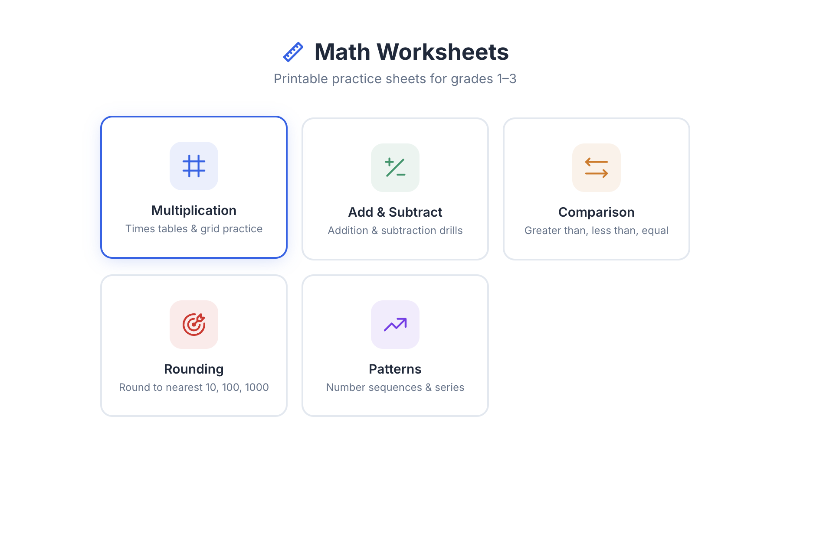
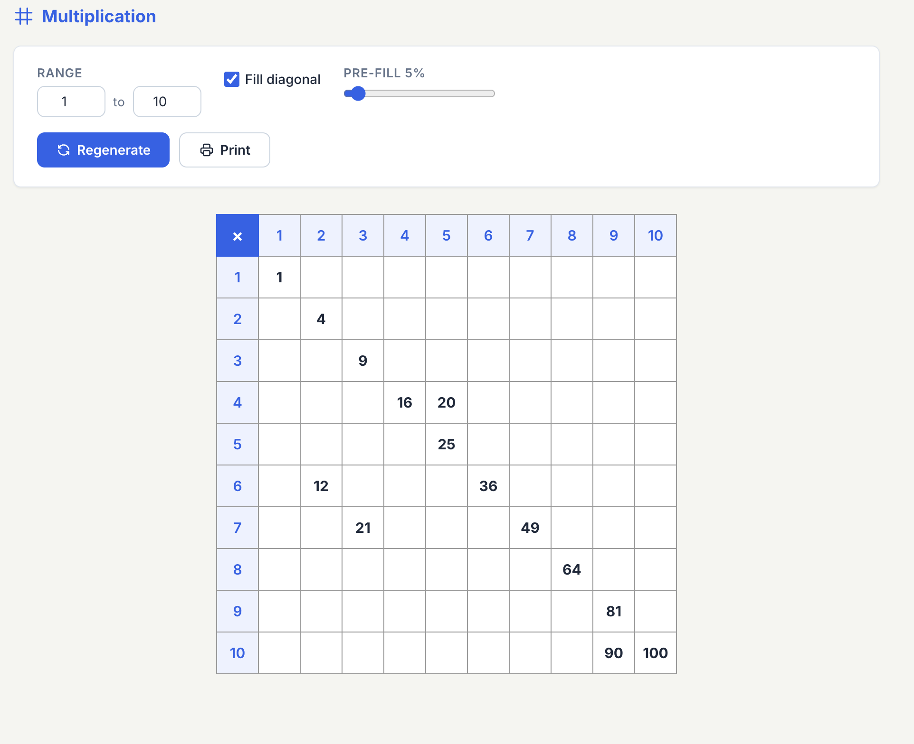
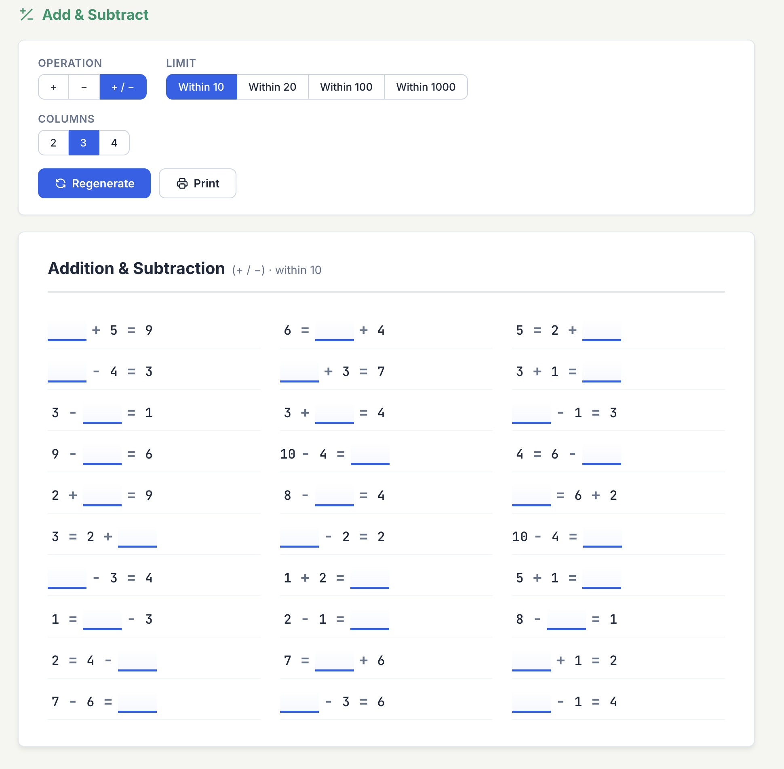

# Math Worksheets

An open-source web app I built to supplement my daughters' math curriculum with printable practice sheets for grades 1–3.



## What's Inside

- **Multiplication** — times tables & grid practice
- **Add & Subtract** — addition and subtraction drills
- **Comparison** — greater than, less than, equal
- **Rounding** — round to nearest 10, 100, 1000
- **Patterns** — number sequences & series

Each worksheet is randomized and printable. Settings persist between sessions so you can pick up where you left off.

|                  Multiplication                   |                 Add & Subtract                  |
| :-----------------------------------------------: | :---------------------------------------------: |
|  |  |

## Getting Started

```sh
npm install
npm run dev
```

## Tech

Built with React + Vite.

## License

[CC BY-NC 4.0](https://creativecommons.org/licenses/by-nc/4.0/) — free to use and adapt for non-commercial purposes with attribution.
