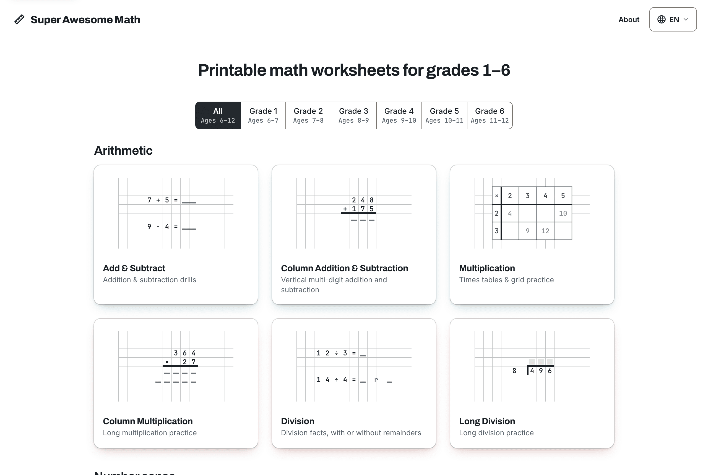
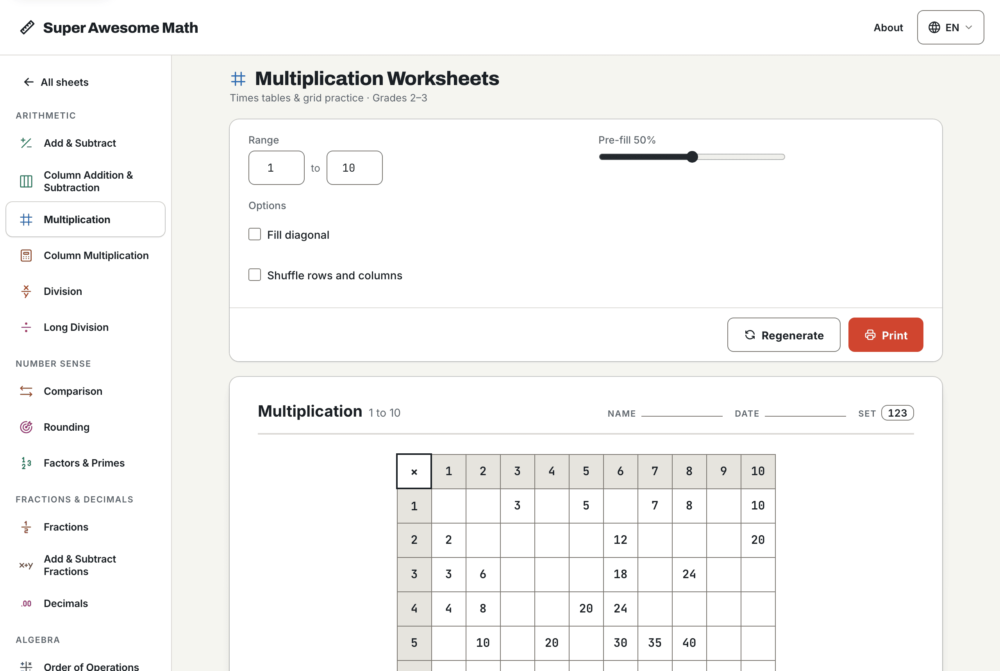
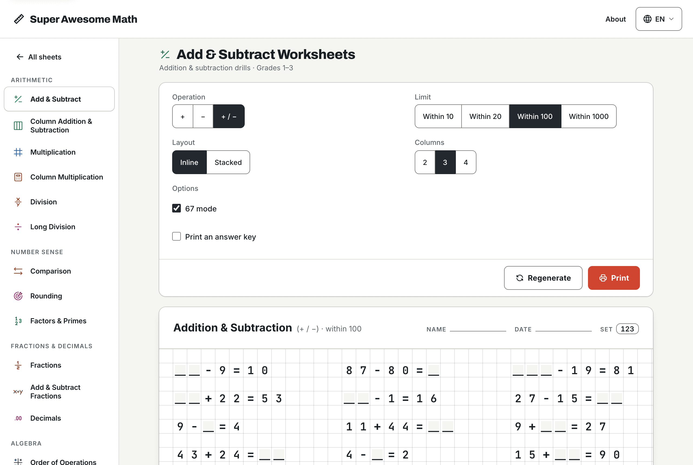

# MathSheets

Free, printable, randomized math worksheets for grades 1–3. An open-source web app I built to supplement my daughters' math curriculum.

**Live:** https://mathworksheets-eight.vercel.app



## What's Inside

- **Multiplication** — times tables & grid practice
- **Add & Subtract** — addition and subtraction drills (with the “67 mode” treasure hunt)
- **Column Addition** — vertical multi-digit addition with carrying
- **Column Multiplication** — long multiplication (3×2 and 4×2 digits)
- **Comparison** — greater than, less than, equal
- **Rounding** — round to nearest 10, 100, 1000
- **Patterns** — number sequences & series
- **Equation Explorer** — interactive on-screen equation solving

Each worksheet is randomized and printable, and has its own URL (`/worksheets/<slug>`). Settings persist between sessions so you can pick up where you left off.

The whole site is available in English, French, Spanish, German, Italian, Russian and Simplified Chinese: pick a language with the globe button in the header, or use the prefixed URLs (`/fr`, `/de/worksheets/rounding`, …). English lives at the root.

|                  Multiplication                   |                 Add & Subtract                  |
| :-----------------------------------------------: | :---------------------------------------------: |
|  |  |

## Getting Started

```sh
npm install
npm run dev      # http://localhost:5176
npm test         # vitest
npm run lint
npm run build    # vite build + scripts/prerender.mjs (static pages, Markdown, sitemap, llms.txt …)
npm run og       # regenerate public/og/*.png social previews with Playwright (npx playwright install chromium once)
```

Optional environment (see `.env.example`): `VITE_GA_MEASUREMENT_ID` enables GA4 (Consent Mode v2, cookieless by default); `VITE_SITE_URL` sets the canonical origin.

## For developers and AI agents

- [/developers](https://mathworksheets-eight.vercel.app/developers) — resources overview
- [/llms.txt](https://mathworksheets-eight.vercel.app/llms.txt) and [/llms-full.txt](https://mathworksheets-eight.vercel.app/llms-full.txt)
- [/worksheets.json](https://mathworksheets-eight.vercel.app/worksheets.json) — machine-readable catalog
- Every page answers `Accept: text/markdown` with its Markdown twin (or append `.md`)
- [AGENTS.md](AGENTS.md) — notes for coding agents working on this repo

## Tech

Built with React + Vite, deployed on Vercel (Routing Middleware handles Markdown content negotiation and agent-friendly 404s).

## License

[CC BY-NC 4.0](https://creativecommons.org/licenses/by-nc/4.0/) — free to use and adapt for non-commercial purposes with attribution.
